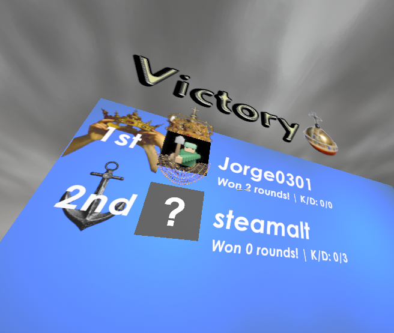

# Straftat K/D (STRAFTAT / BepInEx Mono)

This mod tracks match K/D from the in-game match log stream and augments the Victory scoreboard.

## Installation (manual)
Assuming [BepInEx Mono](https://docs.bepinex.dev/master/articles/user_guide/installation/unity_mono.html) is installed, unzip the release in `STRAFTAT/Bepinex/Plugins`.

## Usage


There will also be an anchor image for the worst K/D score

## Notes
- Kills and deaths that ocurred before when joining mid match wont be counted

## Building

Place required game assemblies in `straftat_kad_score/libs`:
- `Assembly-CSharp.dll`
- `ComputerysModdingUtilities.dll`
- `FishNet.Runtime.dll`
- `UnityEngine.dll`
- `UnityEngine.CoreModule.dll`
- `Unity.TextMeshPro.dll`
- `UnityEngine.UnityWebRequestModule.dll`
- `UnityEngine.UnityWebRequestWWWModule.dll`
- `UnityEngine.JSONSerializeModule.dll`

Then build:

```bash
dotnet build straftat_kad_score.sln
```
